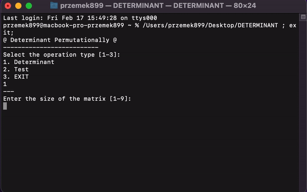

# Determinant Permutationally

### Conditions:
> n -> size of the matrix
> k -> matrix element
> n ∈ [1.9] && n ∈ N

> This program is used to calculate the determinant of a given square matrix using the permutation definition.
